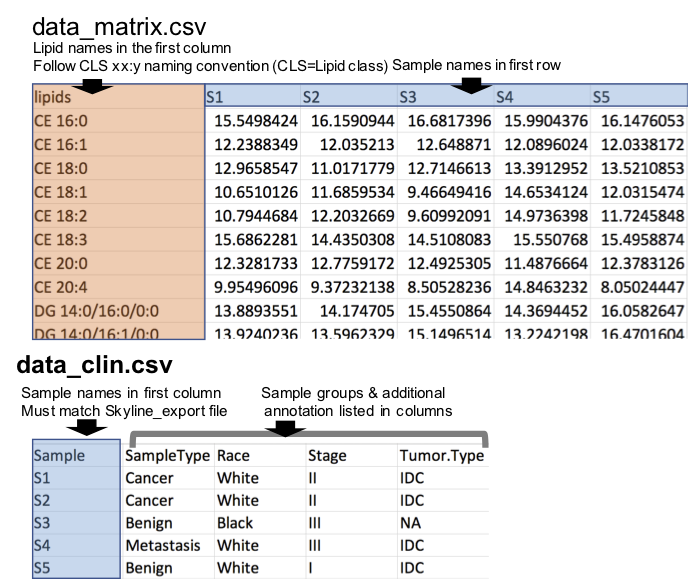
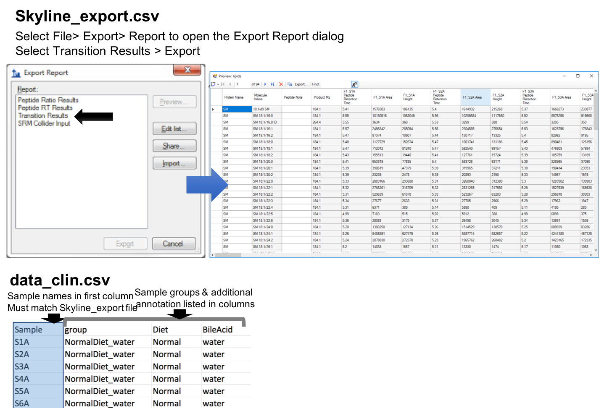

# *lipidr*: Data Mining and Analysis of Lipidomics Datasets in R 

[](https://travis-ci.org/ahmohamed/lipidr)
[](https://codecov.io/github/ahmohamed/lipidr?branch=master)
[](https://bioconductor.org/packages/lipidr/)

## See full guide at [lipidr.org](https://www.lipidr.org/)

## Overall workflow


## Input
### Numerical Matrix
To use `lipidr` for your analysis using numerical matrix as input, you need 2 files: 

1. Numerical table where lipids are rows and samples are columns. Lipid names should be in the first column, and sample names are in the first row. ([see example here](inst/extdata/brca_matrix.csv))
2. A table with the sample annotation / groups, where the sample names are in first column. Note the sample names must be identical in the two files. ([see example here](inst/extdata/brca_clin.csv))



`lipidr` can convert these 2 files to `LipidomicsExperiment` as follows:

```r
d <- as_lipidomics_experiment(read.csv("data_matrix.csv"))
d <- add_sample_annotation(d, "data_clin.csv")
```

### Export from Skyline
Here `lipidr` also requires 2 files:

1. Results exported from Skyline as CSV file (see image below). ([see example here](inst/extdata/A1_data.csv))
2. A table / CSV file with the sample annotation / groups, where the sample names are in first column. Note the sample names must be identical in the two files. ([see example here](inst/extdata/clin.csv))



In `lipidr`:
```r
d <- read_skyline("Skyline_export.csv")
d <- add_sample_annotation(d, "data_clin.csv")
```

## LipidomicsExperiment Object
`lipidr` represents lipidomics datasets as a LipidomicsExperiment, which extends [SummarizedExperiment](http://bioconductor.org/packages/SummarizedExperiment/), to facilitate integration with other Bioconductor packages. 

## Quality control & plotting
`lipidr` generates various plots, such as box plots or PCA, for quality control of samples and measured lipids. Lipids can be filtered by their %CV.  Normalization methods with and without internal standards are also supported.

## Univariate Analysis
Univariate analysis can be performed using any of the loaded clinical variables, which can be readily visualized as volcano plots. Multi-group comparisons and adjusting for confounding variables is also supported (refer to examples on [www.lipidr.org](https://www.lipidr.org/)). A novel lipid set enrichment analysis is implemented to detect preferential regulation of certain lipid classes, total chain lengths or unsaturation patterns. Plots for visualization of enrichment results are also implemented.

## Multivariate Analysis
`lipidr` implements PCA, PCoA and OPLS(DA) to reveal patterns in data and discover variables related to an outcome of interest. Top associated lipids as well as scores and loadings plots can be interactively investigated using `lipidr`.

# Install *lipidr*
## From Bioconductor
In R console, type:

```r
if (!requireNamespace("BiocManager", quietly=TRUE))
    install.packages("BiocManager")
BiocManager::install("lipidr")  
```

## Install development version from GitHub
In R console, type:

```r
library(devtools)   
install_github("ahmohamed/lipidr")
```

